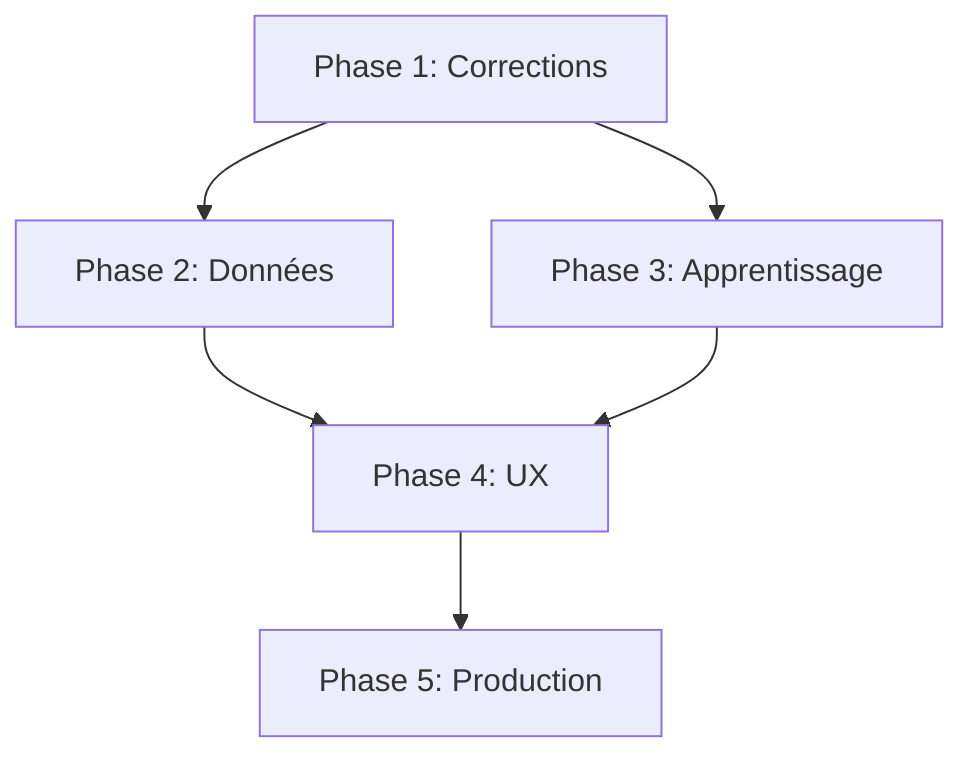

# TAJINE - Roadmap de Développement

**Date:** 2025-12-28
**Version:** MPtoO-V2
**Basé sur:** DIAGNOSTIC.md

---

## Vue d'Ensemble

Cette roadmap définit les priorités de développement pour transformer TAJINE d'un prototype fonctionnel en une plateforme d'intelligence territoriale production-ready.

```
┌─────────────────────────────────────────────────────────────────┐
│                        TAJINE ROADMAP                           │
├─────────────────────────────────────────────────────────────────┤
│  Phase 1: Corrections Critiques          [Semaines 1-2]        │
│  Phase 2: Données Réelles                [Semaines 3-4]        │
│  Phase 3: Apprentissage                  [Semaines 5-6]        │
│  Phase 4: UX Avancée                     [Semaines 7-8]        │
│  Phase 5: Production                     [Semaines 9-10]       │
└─────────────────────────────────────────────────────────────────┘
```

---

## Phase 1: Corrections Critiques
**Durée estimée:** 2 semaines
**Priorité:** 🔴 Critique

### 1.1 Différenciation Mode Rapide/Complet

**Problème:** Les deux modes utilisent le même modèle LLM et produisent des résultats identiques.

**Solution:**
```python
# llm_router.py
MODE_MAPPING = {
    "fast": LLMTier.STANDARD,      # qwen2.5:14b
    "complete": LLMTier.POWERFUL,  # qwen2.5:32b ou 72b
}
```

**Fichiers à modifier:**
- `src/infrastructure/agents/tajine/llm_router.py`
- `src/interfaces/api/v1/tajine/routes.py`
- `frontend/components/chat/ChatView.tsx`

**Critères de succès:**
- [ ] Mode Complet utilise modèle 32b+
- [ ] Temps de réponse affiché différent
- [ ] Qualité de réponse mesurée supérieure

### 1.2 Correction Trust Manager

**Problème:** Ratio 27 échecs / 16 succès bloque l'autonomie.

**Actions:**
1. Auditer les 27 échecs dans les logs
2. Identifier les patterns d'échec récurrents
3. Améliorer les prompts des outils problématiques
4. Reset conditionnel du trust après corrections

**Fichiers:**
- `data/tajine/trust.json`
- `src/infrastructure/agents/tajine/learning/trust_manager.py`
- Logs backend

### 1.3 DataCollector Debug

**Problème:** Aucune donnée de training collectée malgré le système en place.

**Investigation:**
```python
# Vérifier que les callbacks sont appelés
async def on_tool_success(self, tool_name: str, result: Any):
    logger.info(f"Collecting success for {tool_name}")
    # ...
```

**Fichiers:**
- `src/infrastructure/agents/tajine/learning/data_collector.py`
- `src/infrastructure/agents/tajine/tajine_agent.py`

---

## Phase 2: Données Réelles
**Durée estimée:** 2 semaines
**Priorité:** 🟠 Haute

### 2.1 Endpoint Department Stats

**Créer:** `GET /api/v1/tajine/department-stats`

**Spécification:**
```typescript
interface DepartmentStats {
  code: string;           // "75"
  name: string;           // "Paris"
  entreprises_count: number;
  creations_month: number;
  radiations_month: number;
  growth_rate: number;    // Calculé
  top_sectors: string[];
}
```

**Sources de données:**
- SIRENE: Comptage entreprises actives
- BODACC: Créations/radiations du mois
- Calcul: `growth_rate = (creations - radiations) / total * 100`

### 2.2 Connexion Charts aux APIs

| Chart | Source | Transformation |
|-------|--------|----------------|
| FranceMap | department-stats | Coloration par growth_rate |
| GrowthLineChart | BODACC historique | Agrégation mensuelle |
| SectorBarChart | SIRENE NAF codes | Top 10 secteurs |
| HeatmapChart | department-stats | Matrice région/mois |
| RadarChart | Multi-sources | Score composite |
| TreemapChart | SIRENE | Hiérarchie NAF |
| SankeyChart | BODACC | Flux créations/radiations |
| MonteCarloChart | Backend calcul | Simulation Python |

### 2.3 Cache et Performance

**Stratégie:**
```python
# Redis cache avec TTL adapté
CACHE_TTL = {
    "department_stats": 3600,      # 1 heure
    "sirene_search": 300,          # 5 minutes
    "bodacc_recent": 1800,         # 30 minutes
}
```

---

## Phase 3: Apprentissage
**Durée estimée:** 2 semaines
**Priorité:** 🟡 Moyenne

### 3.1 Mémoire Épisodique

**Option A: pgvector (Recommandé)**
```sql
CREATE EXTENSION vector;
CREATE TABLE tajine_memory (
    id SERIAL PRIMARY KEY,
    session_id UUID,
    embedding vector(384),
    content TEXT,
    metadata JSONB,
    created_at TIMESTAMP
);
```

**Option B: Neo4j (Graphe de connaissances)**
```cypher
CREATE (e:Entity {name: "Entreprise X"})
CREATE (t:Territory {code: "75"})
CREATE (e)-[:LOCATED_IN]->(t)
```

### 3.2 Feedback Loop

**Workflow:**
```
User corrige réponse
       ↓
Frontend envoie correction
       ↓
Backend crée PreferencePair
       ↓
DataCollector stocke
       ↓
Trigger DPO quand seuil atteint
```

**Endpoints:**
- `POST /api/v1/tajine/feedback` - Soumettre correction
- `GET /api/v1/tajine/training-stats` - Stats collecte

### 3.3 Fine-tuning Pipeline

**Seuils:**
- SFT: 100 exemples → Déclenche fine-tuning supervisé
- DPO: 50 paires → Déclenche alignement préférences

**Outils:**
- Oumi.ai pour orchestration
- Unsloth pour optimisation QLoRA
- Label Studio pour annotation manuelle

---

## Phase 4: UX Avancée
**Durée estimée:** 2 semaines
**Priorité:** 🟢 Normal

### 4.1 Visualisation PPDSL

**Ajouter widget montrant:**
```
[P]erceive → [P]lan → [D]elegate → [S]ynthesize → [L]earn
    ✓         ✓          ●            ○             ○
```

**Fichier:** `frontend/components/chat/PPDSLProgress.tsx`

### 4.2 Affichage Niveau Cognitif

**Badge dynamique:**
```tsx
<Badge variant={levelColor}>
  {currentLevel} {/* Discovery | Causal | Scenario | Strategy | Theoretical */}
</Badge>
```

### 4.3 WebSocket Synchronisation

**Events à broadcaster:**
```typescript
interface TAJINEEvent {
  type: 'analysis_start' | 'ppdsl_update' | 'analysis_complete';
  payload: {
    session_id: string;
    ppdsl_phase: string;
    cognitive_level: string;
    progress: number;
  };
}
```

**Fichiers:**
- `src/interfaces/api/websocket/handlers.py`
- `frontend/hooks/use-tajine-websocket.ts`

### 4.4 Agent Live VNC

**Reconfiguration:**
```yaml
services:
  browser:
    image: selenium/standalone-chrome:latest
    ports:
      - "4444:4444"  # Selenium
      - "7900:7900"  # noVNC
    environment:
      - SE_VNC_NO_PASSWORD=true
```

---

## Phase 5: Production
**Durée estimée:** 2 semaines
**Priorité:** 🔵 Basse

### 5.1 Monitoring

**Sentry:**
```python
import sentry_sdk
sentry_sdk.init(dsn=os.getenv("SENTRY_DSN"))
```

**Langfuse:**
- Tracer les appels LLM
- Mesurer latence et qualité
- Dashboards de performance

### 5.2 Scaling

**Optimisations:**
- Connection pooling PostgreSQL
- Redis cluster pour cache distribué
- Load balancing Uvicorn workers

### 5.3 Documentation

- API OpenAPI complète
- Guide utilisateur mis à jour
- Runbooks opérationnels

---

## Dépendances Entre Phases



---

## Métriques de Succès

| Métrique | Actuel | Cible Phase 2 | Cible Phase 5 |
|----------|--------|---------------|---------------|
| Trust score | 60% | 75% | 90% |
| Données MOCK | 100% | 20% | 0% |
| Temps réponse | 3-5s | 2-3s | <2s |
| Training data | 0 | 50+ | 500+ |
| Coverage WebSocket | 10% | 60% | 100% |

---

## Risques et Mitigations

| Risque | Impact | Mitigation |
|--------|--------|------------|
| APIs externes rate-limited | Données incomplètes | Cache agressif + fallbacks |
| Modèle 72b trop lent | UX dégradée | Timeout + fallback 32b |
| Fine-tuning échoue | Pas d'amélioration | Validation dataset avant |
| WebSocket saturé | Déconnexions | Message batching |

---

## Ressources Requises

### Humaines
- 1 Backend Python senior
- 1 Frontend React senior
- 0.5 DevOps (Phase 5)

### Infrastructure
- GPU pour modèles 32b+ (existant)
- Stockage pour training data (+10GB)
- Redis cluster (Phase 5)

### Outils
- Sentry (gratuit open-source)
- Langfuse (self-hosted)
- Label Studio (existant)

---

*Roadmap générée par Claude Code (Opus 4.5) - À réviser hebdomadairement*
